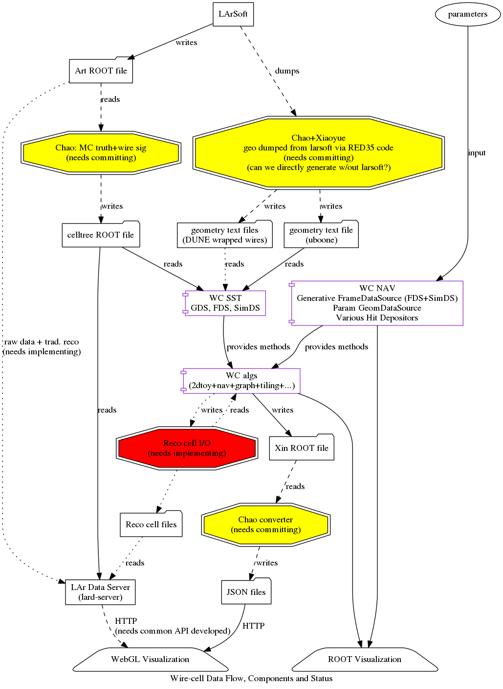

An overview of the system with indications of current status and near
term plans is given as a diagram below.

(figure as [[PDF](../img/ecosystem-data.pdf)] or [[DOT](../img/ecosystem-data.dot)])

The legend for this diagram is:

- **dotted line**
:   this step is missing and needed.

- **dashed line**
:   this step exists but is not captured so that anyone can perform it.

- **solid line**
:   this step exists, documented to some extent and anyone can reproduce it (eg, it's in GitHub).

- **yellow**
:   this process exists but is not generally known/available.

- **red**
:   this process does not exist or is just conceptual and is needed soon.

- **folder shape**
:   some file or file types

- **component shape**
:   some software package

- **rectangle shape**
:   a program

- **trapezoid shape**
:   visualization or end-user application
